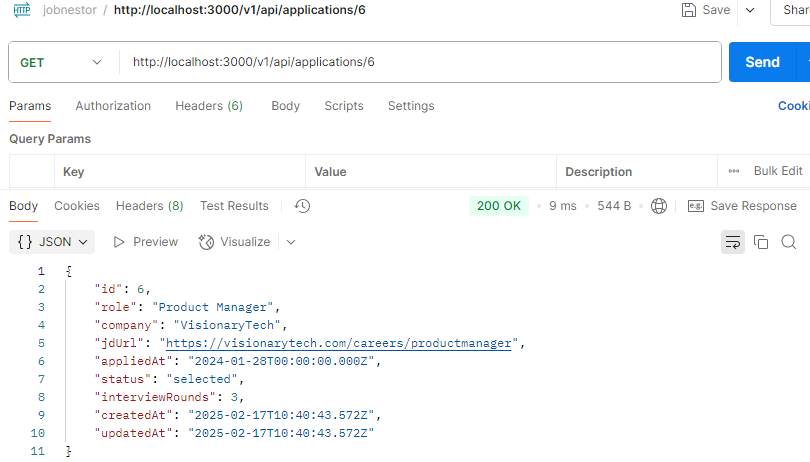
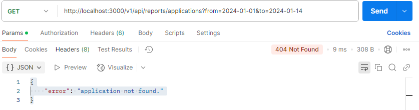

### JobNestor

JobNestor is a job application tracking system that allows users to manage job applications, track interview progress, filter and sort applications, and generate reports.

## 📌 Features

Create, read, update, and delete job applications.

Track interview progress with multiple rounds.

Filter and sort applications by various criteria.

Generate reports based on application data.

## 🛠 Tech Stack & Dependencies 

**Backend:**  
- Express.js - For server setup  
- Sequelize - Database ORM  
- SQLite - Lightweight database  
- Axios - For API calls  
- Jest & Supertest - For testing  
- dotenv - For managing environment variables 
- dotenv.test - for managing test environment variables
- CORS - To allow cross-origin requests

### 📦 **Installed Packages**  
  axios,
  cors,
  dotenv,
  express,
  jest,
  sequelize,
  sequelize-cli,
  sqlite3,
  supertest,

## 🚀 How to Set Up for this project ?

1️⃣ Clone the project Repository
``` sh
git clone https://github.com/Mohdsohail7/jobnestor.git && cd jobnestor
```

2️⃣ Install Dependencies
``` sh
npm install
```

3️⃣ Set Up the Database
// seed the database
```sh
npm seed
``` 

4️⃣ Start the Server
```sh
npm start
```

Once the server is running, the app will be available at http://localhost:3000.

5️⃣ Run Tests
create dummy data for test
``` sh
npm seed:test
```
run test
```sh
npm test
```

### API Endpoints

### Create Job Application

Endpoint: POST /v1/api/applications

Request:
``` sh
{
  "company": "Google",
  "position": "Software Engineer",
  "status": "applied",
  "appliedDate": "2025-02-17"
}
```

Response:

``` sh 
{
  "id": 1,
  "company": "Google",
  "position": "Software Engineer",
  "status": "applied",
  "appliedDate": "2025-02-17"
}
```

**Validation:**
- role and company are required fields.

- appliedAt is optional; if not provided, it defaults to the current date.

Error Handling (400):

- If the required fields are missing, return a 400 Bad Request error:
``` sh
{
  'error': 'Role and company are required.'
}
```

### Get All Job Applications
``` sh
Endpoint: GET /v1/api/applications
``` 
Response:
```sh
[
  {
    "id": 1,
    "company": "Google",
    "position": "Software Engineer",
    "status": "applied",
    "appliedDate": "2025-02-17"
  },
  ....
]
```

### Update Job Application
``` sh
Endpoint: PUT /v1/api/applications/:id
``` 
Request:
``` sh
{
  "status": "interviewing"
}
```
Response:
``` sh
{
  "message": "Application updated successfully."
}
```

### Delete Job Application

Endpoint: DELETE /v1/api/applications/:id

Response:
``` sh
{
  "message": "Application deleted successfully."
}
```

### Get Reports

Endpoint: GET /reports/v1/api/applications?from=2024-01-01&to=2024-01-20

Response:
```sh
[
    {
        "id": 1,
        "role": "Frontend Developer",
        "company": "Innovatech",
        "jdUrl": "https://innovatech.com/careers/frontend",
        "appliedAt": "2024-01-15T00:00:00.000Z",
        "status": "no reply",
        "interviewRounds": 0,
        "createdAt": "2025-02-17T10:04:29.716Z",
        "updatedAt": "2025-02-17T10:04:29.716Z"
    },
    {
        "id": 2,
        "role": "Backend Engineer",
        "company": "CodeWorks",
        "jdUrl": "https://codeworks.com/jobs/backend",
        "appliedAt": "2024-01-20T00:00:00.000Z",
        "status": "no reply",
        "interviewRounds": 1,
        "createdAt": "2025-02-17T10:04:29.716Z",
        "updatedAt": "2025-02-17T10:04:29.716Z"
    },
    {
        "id": 7,
        "role": "DevOps Engineer",
        "company": "CloudFlow",
        "jdUrl": "https://cloudflow.com/jobs/devops",
        "appliedAt": "2024-01-18T00:00:00.000Z",
        "status": "interview",
        "interviewRounds": 1,
        "createdAt": "2025-02-17T10:04:29.716Z",
        "updatedAt": "2025-02-17T10:04:29.716Z"
    },
    {
        "id": 11,
        "role": "Frontend Developer",
        "company": "Innovatech",
        "jdUrl": "https://innovatech.com/careers/frontend",
        "appliedAt": "2024-01-15T00:00:00.000Z",
        "status": "no reply",
        "interviewRounds": 0,
        "createdAt": "2025-02-17T10:04:29.746Z",
        "updatedAt": "2025-02-17T10:04:29.746Z"
    },
    {
        "id": 12,
        "role": "Backend Engineer",
        "company": "CodeWorks",
        "jdUrl": "https://codeworks.com/jobs/backend",
        "appliedAt": "2024-01-20T00:00:00.000Z",
        "status": "no reply",
        "interviewRounds": 1,
        "createdAt": "2025-02-17T10:04:29.746Z",
        "updatedAt": "2025-02-17T10:04:29.746Z"
    },
    {
        "id": 17,
        "role": "DevOps Engineer",
        "company": "CloudFlow",
        "jdUrl": "https://cloudflow.com/jobs/devops",
        "appliedAt": "2024-01-18T00:00:00.000Z",
        "status": "interview",
        "interviewRounds": 1,
        "createdAt": "2025-02-17T10:04:29.746Z",
        "updatedAt": "2025-02-17T10:04:29.746Z"
    }
] 
```

### Get job by specific id

Endpoint: GET /v1/api/applications/:id

if id match then

response
``` sh
{
    "id": 2,
    "role": "Backend Engineer",
    "company": "CodeWorks",
    "jdUrl": "https://codeworks.com/jobs/backend",
    "appliedAt": "2024-01-20T00:00:00.000Z",
    "status": "no reply",
    "interviewRounds": 1,
    "createdAt": "2025-02-17T10:04:29.716Z",
    "updatedAt": "2025-02-17T10:04:29.716Z"
}
```


Endpoint: GET /v1/api/applications/:id

if id not match then

response
``` sh
{
    "error": "Application not found."
}
```

### Update job by specific id

Endpoint: GET /v1/api/applications/:id

Update an existing job application.

Request
``` sh
{
  'status': 'interview',
  'interviewRounds': 1
}
```
Response
``` sh
{
  'id': 1,
  'role': 'Software Engineer',
  'company': 'Tech Corp',
  'jdUrl': 'https://techcorp.com/jobs/se',
  'appliedAt': '2024-02-01',
  'status': 'interview',
  'interviewRounds': 1
}
```

Error Handling (400):

- Return a 400 Bad Request if the status value is invalid:
``` sh
{
  'error': 'Invalid status value.'
}
```

Error Handling (404):

- Return a 404 Not Found if the application doesn’t exist:
``` sh
{
  'error': 'Application not found.'
}
```

### Delete Job by id

Endpoint: GET /v1/api/applications/:id

Delete an application.

Response (Success 204):

- Return 204 No Content on successful deletion.

Error Handling (404):
- Return a 404 Not Found if the application doesn’t exist:
``` sh
{
  'error': 'Application not found.'
}
```

###  create an interview for specific job application

Endpoint: POST /v1/api/applications/:id/interview

Request:
``` sh
{
    "roundNum": 3,
    "roundType": "final interview",
    "interviewDate": "2024-03-25",
    "questions": "Discuss your future career aspirations.",
    "roleOffered": "DevOps Engineer",
    "compensationOffered": "$110,000/year"
  }
  ```
  Response
  ``` sh
  {
    "id": 1,
    "applicationId": 2,
    "roundNum": 3,
    "roundType": "final interview",
    "interviewDate": "2024-03-25",
    "questions": "Discuss your future career aspirations.",
    "roleOffered": "DevOps Engineer",
    "compensationOffered": "$110,000/year"
  }
  ```

  ## Validation:
- roundNum, roundType, and interviewDate are required fields.

Error Handling (400):

- If required fields are missing, return a 400 Bad Request:
``` sh
{
  'error': 'Interview round number, type, and date are required.'
}
```

### Retrieve all interview rounds for a specific application.

Endpoint: GET /applications/:id/interview

Response
``` sh
[
    {
        "id": 1,
        "applicationId": 1,
        "roundNum": 1,
        "roundType": "telephonic",
        "interviewDate": "2024-02-10T00:00:00.000Z",
        "questions": "What is your experience with React?",
        "roleOffered": null,
        "compensationOffered": null,
        "createdAt": "2025-02-17T10:04:29.768Z",
        "updatedAt": "2025-02-17T10:04:29.768Z"
    },
    {
        "id": 11,
        "applicationId": 1,
        "roundNum": 1,
        "roundType": "telephonic",
        "interviewDate": "2024-02-10T00:00:00.000Z",
        "questions": "What is your experience with React?",
        "roleOffered": null,
        "compensationOffered": null,
        "createdAt": "2025-02-17T10:04:29.785Z",
        "updatedAt": "2025-02-17T10:04:29.785Z"
    }
]
``` 

### Reporting and Sorting

 Reporting Endpoints:

Add reporting features for analyzing applications:

Endpoint: GET /reports/applications

Return the total number of applications submitted within a specific time period (e.g., ?from=2024-01-01&to=2024-01-31).

Response

12

 Return the total number of applications by status (e.g., how many interviews, selected, or rejected).

 Endpoint: GET /reports/applications/status

 Response:
 ``` sh
 [
    {
        "status": "accepted",
        "count": 2
    },
    {
        "status": "interview",
        "count": 5
    },
    {
        "status": "no reply",
        "count": 7
    },
    {
        "status": "rejected",
        "count": 4
    },
    {
        "status": "selected",
        "count": 2
    }
]
``` 

### Screenshots of the projects

### Create a new job application.


### Error Handling (400): in create job


### Retrieve all job applications


### Retrieve job by filter


### Retrieve job by id



### Update an existing job application.


### Delete an application.


### Create a interview round for specific job

### ** Validation:


### Retrieve all interview rounds for a specific application.


### Reporing and Sorting

### ** Validation:



### Test Suits


🤝 Contributing
If you want to contribute or add new features, feel free to submit a pull request! 😊

 If you like this project, don't forget to give it a ⭐! 😃

📜 License
This project is licensed under the MIT License.
